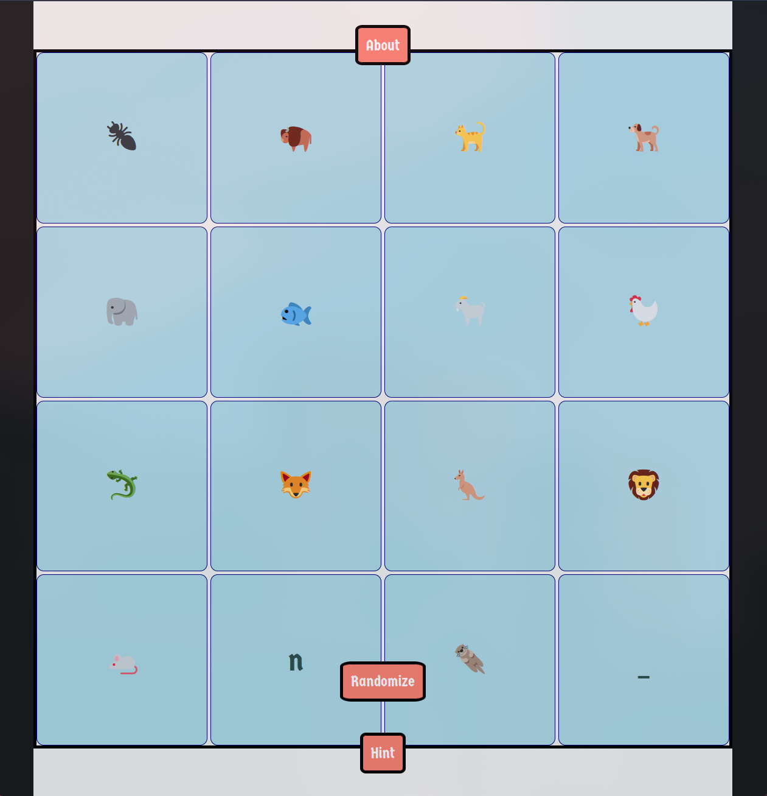

# Puzzle15

Welcome to the 15-Puzzle Game! This project is a fun and interactive version of the classic sliding puzzle, using animal emojis to create a  challenge. Below is a guide on how the project works, how to play the game, and a special hint feature to help you solve the puzzle.

## Project Overview

This project uses HTML, CSS, and JavaScript to create a 15-puzzle game. The game board consists of 15 tiles, each representing a different animal emoji, and one empty space. The goal is to arrange the tiles in alphabetical order by sliding them into the empty space.

### Key Features:
- **Animal Emojis:** The tiles are represented by various animal emojis, making the game visually appealing and enjoyable.
- **Randomization:** You can randomize the board to start a new game.
- **Hint:** A hint feature is available to assist you if you get stuck.
- **Responsive Design:** The game is designed to be responsive, ensuring a smooth experience on different devices.

## How to Play

1. **Start the Game:** When you load the game, you will see a 4x4 grid with 15 animal emojis and one empty space.
2. **Slide the Tiles:** To move a tile, click or tap on an emoji adjacent to the empty space. The tile will slide into the empty space, swapping positions.
3. **Goal:** The aim is to rearrange the tiles in ....some.. order, from 🐜 (ant) to 🦦 (otter), with the empty space at the bottom-right corner.
4. **Winning Condition:** Once the tiles are in the correct order, you WINN!!! :)

## Hint

If you find yourself stuck, don't worry! A hint feature is available to guide you.

<strong>Click here for a hint</strong>

Alphabetical order

## How to Use the Project

1. **Clone the Repository:** Clone this repository to your local machine using `git clone`.
2. **Open the Project:** Open the `index.html` file in your web browser.
3. **Start Playing:** Enjoy the game by sliding the tiles and solving the puzzle!

Enjoy the puzzle, and good luck solving it! 🧩

## Screenshot

---

Feel free to explore the code, suggest improvements, or fork the project to create your own version. Happy coding!
Arcade 33
